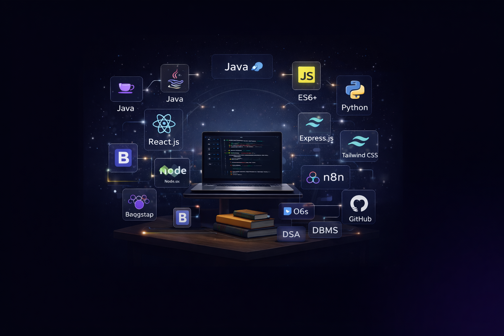

<p align="center">
  
</p>

<h1 align="center">🚀 Hitaishi Lohtia – Personal Portfolio</h1>

<p align="center">
  <strong>Software Engineer | Full Stack Developer | AI Enthusiast</strong>
</p>

<p align="center">
  <a href="https://port-folio-git-main-hitaishis-projects-e3bf07a7.vercel.app/">
    
  </a>
  <a href="https://github.com/hitaishi18-coder">
    
  </a>
  <a href="https://www.linkedin.com/in/hitaishi-lohtia-99a219256/">
    
  </a>
  <a href="mailto:hitaishi.8.8.8@gmail.com">
    
  </a>
</p>

<p align="center">
  
  
  
  
</p>

---

## 📋 Table of Contents

- [✨ Overview](#-overview)
- [🎯 Key Features](#-key-features)
- [🛠️ Tech Stack](#️-tech-stack)
- [📁 Project Structure](#-project-structure)
- [⚡ Quick Start](#-quick-start)
- [🖼️ Screenshots](#️-screenshots)
- [💼 Featured Projects](#-featured-projects)
- [📜 Certifications](#-certifications)
- [🗓️ Learning Journey](#️-learning-journey)
- [🔮 Roadmap](#-roadmap)
- [👤 About Me](#-about-me)
- [📄 License](#-license)

---

## ✨ Overview

A modern, responsive, and interactive personal portfolio designed to showcase my skills, projects, achievements, and professional journey as a **Software Engineer** and **Full Stack Developer**. Built with cutting-edge web technologies, this portfolio features a sleek UI with smooth animations, light/dark theme toggle, and an immersive user experience.

> **"A showcase of creativity, technical expertise, and professional growth in the world of development."**

---

## 🎯 Key Features

| Feature | Description |
|---------|-------------|
| 🌗 **Theme Toggle** | Seamless switch between light and dark modes |
| 🎵 **Background Music** | Ambient audio experience on landing page |
| 🧭 **Sticky Navigation** | Smooth scroll navigation across all sections |
| 📱 **Fully Responsive** | Optimized for mobile, tablet, and desktop |
| 🧠 **AI Assistant** | Interactive AI-powered chatbot integration |
| ⚡ **Fast Performance** | Built with Vite for lightning-fast load times |
| 🎨 **Modern UI/UX** | Glassmorphism, gradients, and micro-animations |
| 📊 **Learning Timeline** | Visual representation of skill progression |
| 🏆 **Achievements Showcase** | Highlighted awards and accomplishments |
| 📜 **Certifications** | Professional credentials with direct links |

---

## 🛠️ Tech Stack

### Frontend
| Technology | Purpose |
|------------|---------|
|  | UI Component Library |
|  | Build Tool & Dev Server |
|  | Utility-First CSS Framework |
|  | Programming Language |

### Development Tools
| Tool | Purpose |
|------|---------|
|  | Runtime & Package Manager |
|  | Code Linting |
|  | Version Control |

### Deployment
| Platform | Status |
|----------|--------|
|  | ✅ Production |

---

## 📁 Project Structure

```
portfolio/
├── 📂 public/
│   ├── hitaishi-image.jpeg     # Profile photo
│   ├── skills.png              # Skills banner
│   ├── resume.pdf              # Downloadable resume
│   └── [project-images]        # Project screenshots
│
├── 📂 src/
│   ├── 📂 assets/
│   │   ├── intro.mp3           # Background music
│   │   ├── projects/           # Project assets
│   │   └── achievements/       # Achievement images
│   │
│   ├── 📂 components/
│   │   ├── Navbar.jsx          # Navigation bar with theme toggle
│   │   ├── Introduction.jsx    # Hero section with profile
│   │   ├── Skills.jsx          # Technical expertise display
│   │   ├── LearningJourney.jsx # Timeline of learning
│   │   ├── Projects.jsx        # Featured projects grid
│   │   ├── Achievements.jsx    # Awards & accomplishments
│   │   ├── Certifications.jsx  # Professional certifications
│   │   ├── Prize.jsx           # Prize highlights
│   │   ├── Testimonials.jsx    # Recommendations
│   │   ├── AiAssistant.jsx     # AI chatbot component
│   │   ├── Background.jsx      # Animated background
│   │   ├── Footer.jsx          # Contact & social links
│   │   └── DogCursor.jsx       # Custom cursor effect
│   │
│   ├── App.jsx                 # Main application router
│   ├── Home.jsx                # Portfolio home page
│   ├── Landing.jsx             # Landing/welcome page
│   └── index.css               # Global styles
│
├── index.html                  # HTML entry point
├── package.json                # Dependencies & scripts
├── vite.config.js              # Vite configuration
├── tailwind.config.js          # Tailwind configuration
└── README.md                   # Project documentation
```

---

## ⚡ Quick Start

### Prerequisites

- [Bun](https://bun.sh/) (recommended) or [Node.js](https://nodejs.org/) v18+
- [Git](https://git-scm.com/)

### Installation

1️⃣ **Clone the repository**
```bash
git clone https://github.com/hitaishi18-coder/portfolio.git
cd portfolio
```

2️⃣ **Install dependencies**
```bash
# Using Bun (recommended)
bun install

# Or using npm
npm install
```

3️⃣ **Start the development server**
```bash
# Using Bun
bun dev

# Or using npm
npm run dev
```

4️⃣ **Open in browser**
```
http://localhost:5173
```

### Build for Production

```bash
# Build the application
bun run build

# Preview the production build
bun run preview
```

---

## 🖼️ Screenshots

<p align="center">
  <i>Landing Page with Interactive Elements</i>
</p>

<p align="center">
  <i>Skills & Technical Expertise Section</i>
</p>

<p align="center">
  <i>Featured Projects Showcase</i>
</p>

---

## 💼 Featured Projects

### 🧠 MindSync – AI Neuro-Productivity System
> An intelligent productivity platform leveraging AI and computer vision for enhanced focus and task management.

**Tech Stack:** `MERN` • `AI` • `Computer Vision`

[](https://mind-sync-mu.vercel.app)
[](https://github.com/hitaishi18-coder/mind-sync)

---

### 🎯 DIECAI – Decision Intelligence Engine
> A conceptual AI-driven system focused on decision intelligence, structured thinking, and AI automation workflows.

**Tech Stack:** `System Design` • `AI Concepts`

[](https://www.diecai2025.com/)
[](https://github.com/Rohaz-bhalla/DIECAI-GNDU)

---

### 🛒 ShopEase – Smart AI Shopping Assistant
> An AI-powered e-commerce assistant providing intelligent product recommendations and customer support.

**Tech Stack:** `MERN` • `AI Concept` • `LLM API`

[](https://shopease-ai-support.vercel.app/)
[](https://github.com/hitaishi18-coder/shopease-ai-support)

---

### 🛍️ AI-Powered E-Commerce Platform
> Full-featured e-commerce website with AI integration for enhanced shopping experience.

**Tech Stack:** `Node.js` • `JavaScript` • `AI Integration`

[](https://project-ecommerce-shopping-website-1.onrender.com/)
[](https://github.com/hitaishi18-coder/project-Ecommerce-shopping-website)

---

### ⚙️ n8n Daily Joke Notifier
> Automated workflow system using n8n for daily notifications and API integrations.

**Tech Stack:** `n8n` • `APIs` • `Twilio` • `Automation`

[](https://n8n-latest-qhs9.onrender.com)
[](https://github.com/hitaishi18-coder/n8n-daily-tech-notifier)

---

## 📜 Certifications

| Certification | Provider | View |
|--------------|----------|------|
| **Web Development with Node.js** | Professional Certification | [📄 View Certificate](https://drive.google.com/file/d/1X_9u9O5ALdgfDreMIdajpK2YWDkUio_Z/view) |
| **SQL & Database Management** | Professional Certification | [📄 View Certificate](https://drive.google.com/file/d/16_FyZJa_OGUjM4H0fdD0qsBmco1Ay4Et/view) |
| **MERN Stack Development** | Professional Certification | [📄 View Certificate](https://drive.google.com/file/d/1w6HYD7j-DyxL3Dv7slFM2yZvlApyyecw/view) |
| **Data Structures & Algorithms in Java** | Professional Certification | [📄 View Certificate](https://drive.google.com/file/d/1jCvYEJM1h7IpfE8_tpscmoM6cxC_uMn7/view) |
| **MERN Stack Bootcamp** | Intensive Training | [📄 View Certificate](https://drive.google.com/file/d/14lmihWDg0PZerO3JbHl1gIkfnfVI0LDX/view) |

---

## 🗓️ Learning Journey

```
📅 2022    🐍 Python Fundamentals
           ├── Programming basics
           └── Scripting & automation

📅 2023    💻 C Language & Programming
           ├── Low-level programming
           └── Memory management concepts

📅 2024    🌐 Web Development & Backend
           ├── JavaScript & Node.js
           ├── Java programming
           └── Real-world projects

📅 2025    🚀 Advanced Technologies
           ├── DSA mastery
           ├── MERN Stack expertise
           ├── AI & automation workflows
           └── DIECAI system design
```

---

## 🔮 Roadmap

- [x] ✅ Responsive design across all devices
- [x] ✅ Light/Dark theme toggle
- [x] ✅ AI Assistant integration
- [x] ✅ Resume download functionality
- [ ] 🔄 Mobile hamburger menu improvements
- [ ] 🔄 Active section highlighting in navbar
- [ ] 🔄 SEO optimization
- [ ] 🔄 Dedicated DIECAI case study page
- [ ] 🔄 Blog integration
- [ ] 🔄 Analytics dashboard

---

## 👤 About Me


### **Hitaishi Lohtia**
**Software Engineer | Full Stack Developer**

📍 **Location:** Amritsar, Punjab, India

I am a passionate Software Engineer with hands-on experience building scalable web applications using the **MERN stack**. I have a strong foundation in:

- 📊 **Data Structures & Algorithms**
- 🧩 **Object-Oriented Programming**
- 🗄️ **Database Management (SQL & NoSQL)**
- 🔌 **RESTful API Development**

I enjoy building real-world products including e-commerce platforms, AI-powered applications, and backend services — always focusing on clean code and performance.

### 🔗 Connect with Me

<p>
  <a href="https://github.com/hitaishi18-coder">
    
  </a>
  <a href="https://www.linkedin.com/in/hitaishi-lohtia-99a219256/">
    
  </a>
  <a href="mailto:hitaishi.8.8.8@gmail.com">
    
  </a>
</p>

---

## 📄 License

This project is licensed under the **MIT License**.

```
MIT License

Copyright (c) 2025 Hitaishi Lohtia

Permission is hereby granted, free of charge, to any person obtaining a copy
of this software and associated documentation files (the "Software"), to deal
in the Software without restriction, including without limitation the rights
to use, copy, modify, merge, publish, distribute, sublicense, and/or sell
copies of the Software, and to permit persons to whom the Software is
furnished to do so, subject to the following conditions:

The above copyright notice and this permission notice shall be included in all
copies or substantial portions of the Software.

THE SOFTWARE IS PROVIDED "AS IS", WITHOUT WARRANTY OF ANY KIND, EXPRESS OR
IMPLIED, INCLUDING BUT NOT LIMITED TO THE WARRANTIES OF MERCHANTABILITY,
FITNESS FOR A PARTICULAR PURPOSE AND NONINFRINGEMENT.
```

---

<p align="center">
  <b>⭐ If you found this portfolio inspiring, please consider giving it a star!</b>
</p>

<p align="center">
  
  
</p>

<p align="center">
  Made with 💜 by <a href="https://github.com/hitaishi18-coder">Hitaishi Lohtia</a>
</p>
